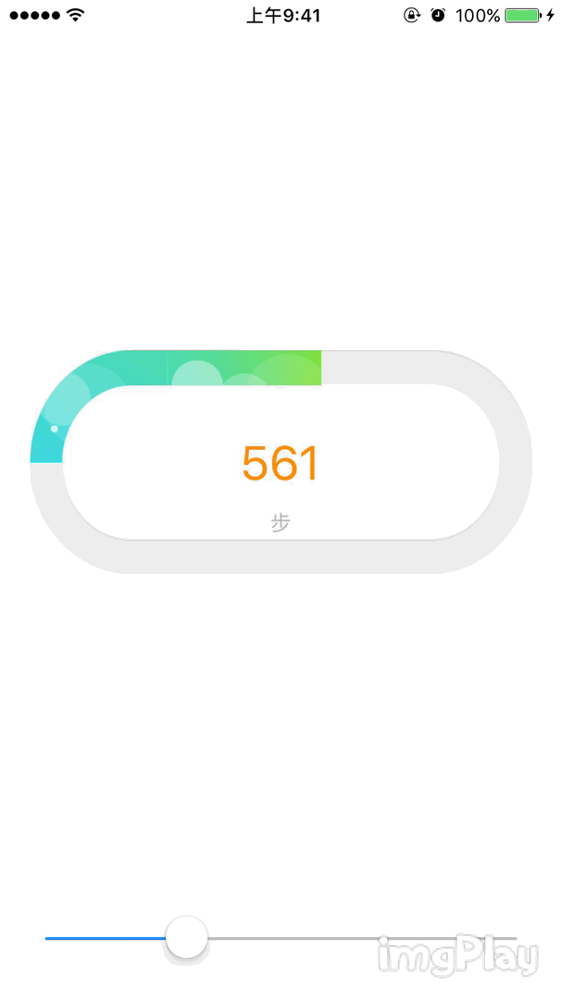

# SportProgressView

SportProgressView是自定义椭圆进度条，实现效果如图示：

整个控件主要公开两个属性progress和stepLabel

progress：取值范围0.0~1.0，当大于1.0时，为整个椭圆

stepLabel：为UILabel，对text赋值字符串NSString，显示椭圆中间的数字

应用时只需使用SportProgressView.h和SportProgressView.m两个文件，具体用法参考工程项目Demo，图片资源可以自定义替换。